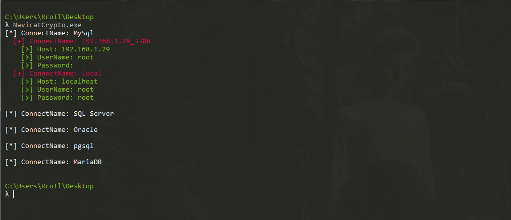

## NavicatCrypto

本工具由 `C#` 编写，主要是遍历 `Navicat` 相对于的注册表。

核心代码直接引用 [**how-does-navicat-encrypt-password**](https://github.com/DoubleLabyrinth/how-does-navicat-encrypt-password) 当中的 `C#` 代码 ，且未做任何修改。

效果如下：

