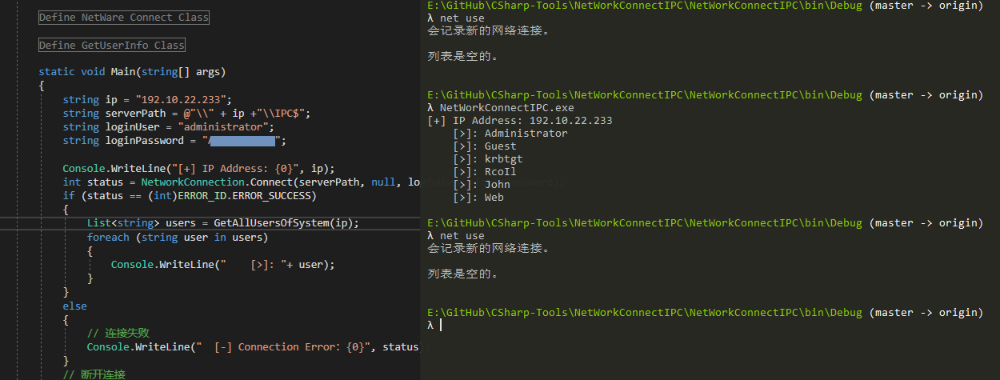

这是对 [【域渗透】获取域环境内用户登录信息](https://rcoil.me/2018/11/%E3%80%90%E5%9F%9F%E6%B8%97%E9%80%8F%E3%80%91%E8%8E%B7%E5%8F%96%E5%9F%9F%E7%8E%AF%E5%A2%83%E5%86%85%E7%94%A8%E6%88%B7%E7%99%BB%E5%BD%95%E4%BF%A1%E6%81%AF/) 中 **0x01 查看域内机器的用户目录文件夹** 内容的一个代码补充。

我们并不需要去查看文件夹，`IPC$` 连接本身就能获取远程主机的信息，添加账号密码，删除账号，获取系统信息等等。

由于本工程只是一个补充，所以代码仅限于获取远程主机的账号列表。如需遍历IP或主机名，请自行改写。

效果如下：

