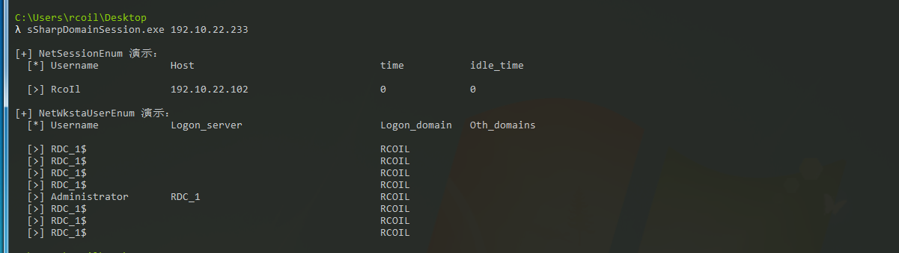

# SharpDomainSession 

`NetSessionEnum` 和 `NetWkstaUserEnum` 是 [SharpHound](https://github.com/BloodHoundAD/SharpHound) (BloodHound) 公开的两种不同的查询计算机会话信息的方法。两种方法都从检查 445 端口开始。

详细内容请转至 [SharpHound: Target Selection and API Usage](https://blog.cptjesus.com/posts/sharphoundtargeting) 进行更深的阅读。

**此 Demo 检测结果如下所示：**

- 检测结果

