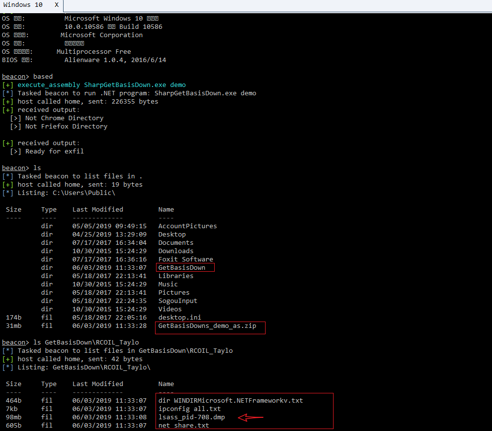

## SharpGetBasisDown

更新记录

- 2019年5月8日：获取浏览器浏览历史等相关数据库文件

- 2019年5月9日：添加 `zip` 压缩文件夹功能

- 2019年5月9日：添加执行内置命令功能，将执行结果进行保存

- 2019年5月10日：添加对 `zip` 包进行 `AES` 加密

- 2019年5月11日：添加高权限 `dump lsass` 内存功能

- 2019年5月12日：添加全盘目录文件遍历、屏幕截图功能

- 2019年5月13日：配合 `Cobalt Strike` 的 `execute-assembly` 功能进行测试

- 2019年5月22日：添加获取3389 远程登陆记录，去除全盘文件遍历、屏幕截图功能

  ​

### 测试结果

