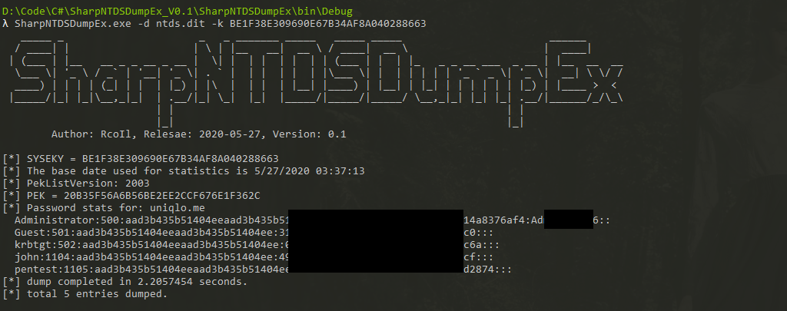

该工具参考了zcgonvh 的 [NTDSDumpEx](https://github.com/zcgonvh/NTDSDumpEx) 和 Dionach 组织的 [NtdsAudit](https://github.com/Dionach/NtdsAudit)。暂未加入离线解析注册表单元的功能，如果需要，请参考：https://github.com/EricZimmerman/Registry


#### Usage

```
usage: SharpNTDSDumpEx.exe <-d ntds.dit> <-k HEX-SYS-KEY |-r
-d    path of ntds.dit database
-k    use specified SYSKEY
-r    read SYSKEY from registry
```


#### Example

```
ntdsdumpex.exe - r
ntdsdumpex.exe -d ntds.dit -k BE1F38E309690E67B34AF8A040288663
```




#### NOTE

```
MUST BACKUP database file,and repair it frist(run [esentutl /p /o ntds.dit] command).
```


#### Reference Source

https://github.com/Dionach/NtdsAudit

https://github.com/zcgonvh/NTDSDumpEx

