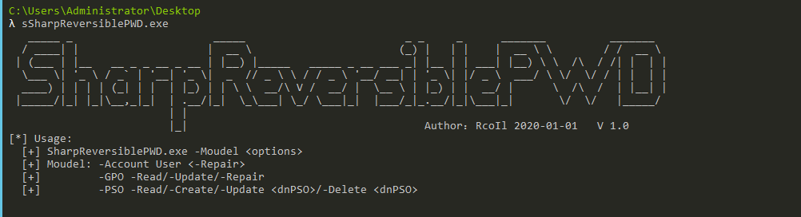

该工具三大模块独立编写，所以会有很多重复的代码，优化空间为 85%。各位读者可在原来的基础上进行二次开发利用。

使用方法：

```
SharpReversiblePWD.exe -Account 用户名 // 为单用户启用可逆加密
SharpReversiblePWD.exe -Account 用户名 -Repair // 为单用户取消可逆加密

SharpReversiblePWD.exe -GPO -Read // 读取默认的密码策略
SharpReversiblePWD.exe -GPO -Update // 更改默认的密码策略，启用可逆加密
SharpReversiblePWD.exe -GPO -Repair // 还原默认的密码策略

SharpReversiblePWD.exe -PSO -Read // 读取所有 PSO
SharpReversiblePWD.exe -PSO -Create // 创建名为 TestPSO 的 PSO
SharpReversiblePWD.exe -PSO -Update "CN=TestPSO,...." // 为指定 PSO 配置可逆加密
SharpReversiblePWD.exe -PSO -Delete "CN=TestPSO,...." // 删除指定 PSO 
```

