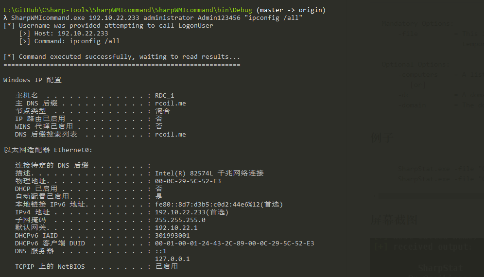

### SharpWMIcommand

使用 WMI 运行 `"cmd.exe /c command > C:\Windows\Temp\winstore.ini"` 的实时程序，使用 SMB 远程读取和删除 `winstore.ini` 文件。

#### 描述

为了日常方便执行命令，及执行结果回显。

使用 `LogonUser` 本地登陆目标账号，方便 SMB 远程读取和删除文件。通过 `win32_process` 创建远程WMI 进程执行命令。

PS: 一堆明显的数据包

#### 用法：

```powershell
SharpWMIcommand.exe host username password command


Examples:

SharpWMIcommand.exe 192.10.22.233 administrator Admin123456 "ipconfig /all"
```



#### 参考：

https://github.com/GhostPack/SharpWMI

https://github.com/Raikia/SharpStat