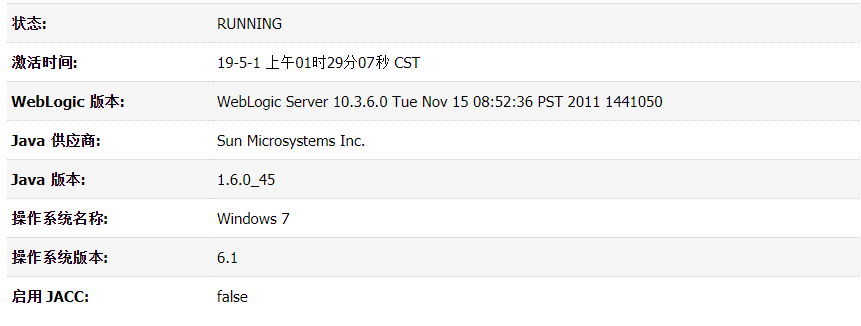
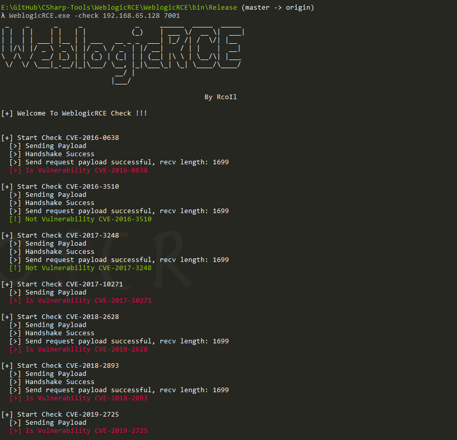

# WeblogicRCE 

目前仅支持检测如下漏洞：

- CVE-2016-0638
- CVE-2016-3510
- CVE-2017-3248
- CVE-2017-10271
- CVE-2018-2826
- CVE-2018-2893
- CVE-2019-2724

当然，其中的poc可能会存在一些问题，请自行解决。

**本地检测环境与检测结果如下所示：**

- 测试环境

- 检测结果

